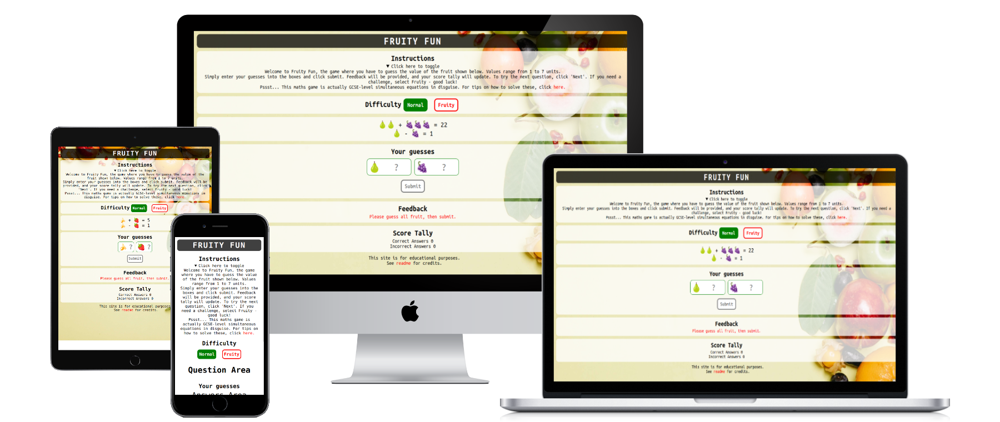
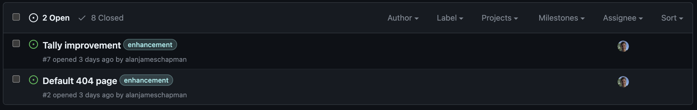

# Fruity Fun

[Fruity Fun](https://alanjameschapman.github.io/fruity-fun/) is a solo puzzle game, in which the user must deduce the value of each fruit shown in the 'shopping basket'. This can be done using trial-and-error or by solving as simultaneous equations. As such, this site is predominantly intended for secondary school Maths students but can be enjoyed by anyone who likes a puzzle!

## Planning

The website has been designed for mobile-first, from iPhone 6 and onwards, and will be responsive for larger screen sizes. It is envisaged that the majority of users will be viewing from mobiles. Moreover, it is easier to design for small screens then enlarge for desktops vs the other way around.



### User Experience

As a user, I want to:
- Play a solo, fun interactive game.
- Learn fundamental mathematical concepts.
- Ability to change the level of difficulty, depending on ability.
- Input my guesses, receiving feedback of any invalid inputs.
- Get feedback when my mouse is hovering above valid inputs.
- Keep tally of my correct and incorrect guesses.

### Color palette and contrast

A fruity background has been used to add realism. The vibrant, colorful variation of fruit lends itself well to good contrast, but this was validated using Lighthouse.

### Font Choice

A font without serifs was used to add a desirable informal tone to the site. It has an old-school video game feel to it which seems appropriate.

Chakra Petch is a variable font, which may help to reduce font family file size.

### Lessons learned from previous project implemented here

- Background image compressed with tinyPNG, in an effort to improve lighthouse performance.
- Section on bug fixes included.
- HTML and CSS validation errors addressed or fixed.
- Favicon included.
- Submit buttons and input boxes styled to suit site design.
- Commit messages like "take 2" avoided.

## Functionality

For a description of each function, docstrings are provided within the JS file. The site is broken down into the following sections:

### Instructions Area

Instructions provided to user, along with a link to help them understand how to answer the questions.

### Game Mode Area

Allows the user to select their preferred difficulty level using submit buttons.

### Question Area

Displays a set of equations using emoji strings, always evaluating to positive answers for realism.

### Answer Area

Allows the user to input their guesses. Input fields are constrained to value between 1 and 7 units as per instructions.

### Feedback Area

Displays feedback ot the user, showing how their guesses compare with the correct answers.

### Score Area

Displays a tally of correct and incorrect answers.

## Testing and Debugging Code

See [TESTING](TESTING.md) for details.

## Deployment

The site was deployed to GitHub pages. The steps to deploy were as follows:

- In the GitHub repository, I navigated to the Settings tab
- From the source section drop-down menu, I selected the Master Branch
- Once the master branch was selected, the page refreshed with a ribbon showing successful deployment.
- The live link can be found [here](<https://alanjameschapman.github.io/fruity-fun/>)

## Future Enhancements

Instead of an incremental tally a countdown could be used to add some jeopardy. Perhaps a countdown from 5 lives.

Some adjustments could be made to the styling to improve layout. A customized page 404 would be nice to have too.

These enhancements are documented using GitHub as open issues [here](https://github.com/alanjameschapman/fruity-fun/issues?q=is%3Aopen+is%3Aissue).



NB. Site-themed page 404 added on 15/11/2023.

## Resubmission

Assessment of the deployed site showed that there was an error in the console due to a missing block of code in the JS file at submission. This was fixed by adding the missing block of code back in:
    
```javascript
/** Gets old incorrect score and increments by 1*/
function incrementIncorrect() {
    let oldScore = parseInt(document.getElementById("incorrect").innerText);
    document.getElementById("incorrect").innerText = ++oldScore;
}
```

This code increments the Incorrect Answers tally, in the same way that the Correct Answers tally is incremented. The site was then re-deployed and the error was resolved.

During project resubmission, the input fields were updated to include a stepper for better User Experience. This effectively eliminates the possibility of invalid inputs.

## Credits

### Peer Review

Following on from #peer-code-review on Slack (Bogdan Iacob) and mentor (David Bowers) feedback I implemented a few improvements:

- Used aria-label instead of label
- Centrally-justified using flexbox
- Amended heading structure.

### Content

The Chakra Petch font was taken from Google Fonts and the author is Cadson Demak.

The background image is from [Pexels](https://www.pexels.com/). The author is Any Lane.

The favicon is from the open source project Twemoji, copyright 2020 Twitter, Inc and other contributors. It is licensed under CC-BY 4.0.

The site is intended solely for educational purposes. All images and favicons remain the property of those credited above

### Structure

The Code Institute's Love Maths! website was used as guidance for semantic structure and commit journey.

Some elements of this Readme have been taken and repurposed from the Readme shared by the author's PP1.
