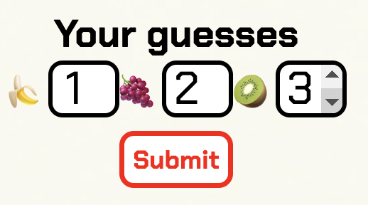
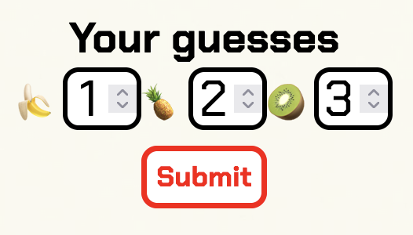
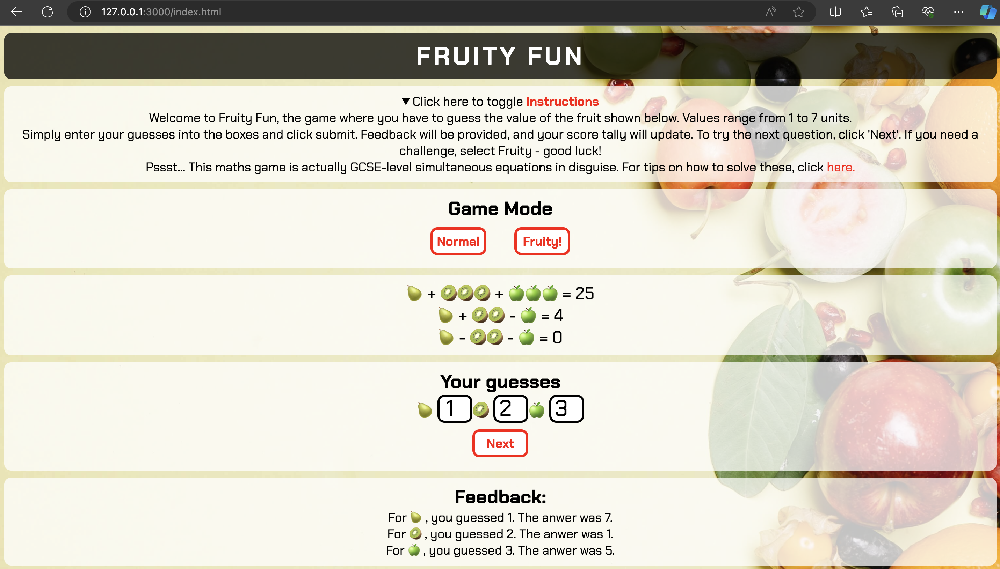

# Code Validation

## JSHint Validation

Coding errors were caught and fixed using the CI-recommended JS [validator](https://jshint.com/). The deployed site returned no errors.

## User Story Checks

| As a user, I want to... | Requirement met | Evidence |
| :---------------------- | :------------: | :-------: |
| Play a solo, fun interactive game | YES | Interactive features: game mode, mouse hover feedback, guess feedback, score tally. |
| Learn fundamental mathematical concepts | YES |  |
| Ability to change the level of difficulty, depending on ability | YES |  |
| Input my guesses, receiving feedback of any invalid inputs | YES |  |
| Get feedback when my mouse is hovering above valid inputs | YES |  |
| Keep tally of my correct and incorrect guesses | YES |  |

## Input Validation

The only user input was for the user guesses, and validated for various incorrect inputs as shown below.

| Inputs Validated | Validation Test | Expected Outcome | Actual Outcome | Pass/Fail |
| :--------------: | :-------------: | :--------------: | :------------: | :-------: |
| Guesses | '', letter and invalid number (0 and negative) | Print error, repeat input prompt |  | PASS |

## Browser Testing

When tested across Chrome, Firefox and Edge, it was noted that the guess input box steppers display slightly smaller for Firefox, but arrows could still be clicked without trouble so this was not deemed unacceptable.

| Browser | Image(s) |
| ------- | :------: |
| Chrome |  |
| Firefox |  |
| Edge |  |

## HMTL validation

No errors were returned when passing through the W3C HTML validator.

## CSS validation

No errors were found when passing through the [W3C HTML validator](http://jigsaw.w3.org/css-validator/validator?lang=en&profile=css3svg&uri=https%3A%2F%2Falanjameschapman.github.io%2Ffruity-fun%2F&usermedium=all&vextwarning=&warning=1).

## LIGHTHOUSE validation

Initial lighthouse results showed room for improvement in all facets, bar 'Best Practices'.

Adding labels to the input boxes, reducing transparency (to improve contrast ratio), and adjusting heading levels made a slight improvement to accessibility - 83 to 85, so this might be addressed later:

Adding meta tags to the html head increased the SEO from 82 to 100:

The remaining improvements are regarding Accessibility:

Adding aria-labels to the input fields improves accessibility from 87 to 97:

The deployed site shows further improvement in performance:

## Debugging

Bugs were managed using GitHub's Issues functionality - click [here](https://github.com/alanjameschapman/fruity-fun/issues?q=is%3Aissue+is%3Aclosed) to see all issues. All issed labelled 'bugs' have been closed, along with various 'enhancements'. Some 'enhancements' have been raised for potential future work.

Code blocks isolated and refactored using [python tutor](<https://pythontutor.com/>)

### Debugging notes

The first main hurdle I faced was accessing the fruit1 and fruit2 variables. I needed to access these from the checkAnswers function but the fruit values were assigned within the scope of the displayEasyQuestion function. I believe the problem would have been easiest to solve by assigning these in the global scope but I understood that we were trying to avoid this practice for this project.

I spent a long time trying to pass these as parameters from one function to the next. Chrome devtools proved particularly useful here, as I was able to step through my code and pinpoint exactly when the variables vanished from Scope, although I ultimately failed to carry them through to the checkAnswers function. Eventually I realised I could access these from the DOM using a combination of parseInt, getElementsById, and using unique IDs within the HTML which had itself been created using template litorals.

I initially chose to create all variables within each displayGame but realised that this would create repetition. Creating the variables in runGame will reduce this code bloating. These variables then need to be checked to ensure that the Answer value of each equation is positive. The next decision is therefore whether to check these values within runGame or each respective displayQuestion. The former was chosen to avoid the scenario where the execution jumps back-and-forth between runGame and displayQuestion. This seems more efficient.

I also struggled to pass through gameMode from the event listener, but eventually solved this using the .firstchild method to get from the DOM.